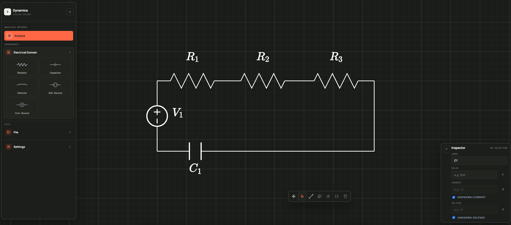
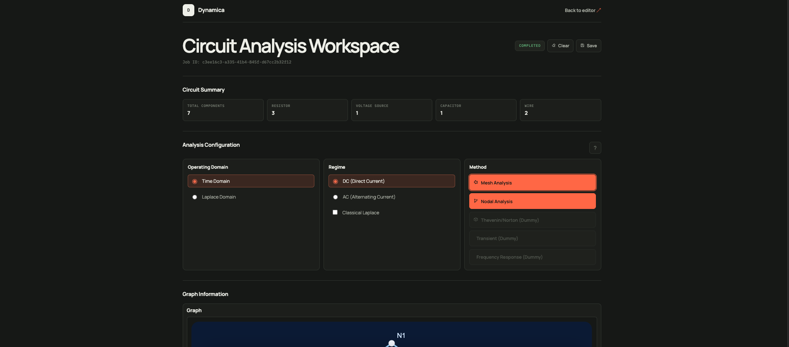

# Dynamica

[](https://react.dev/)
[](https://www.typescriptlang.org/)
[](https://vite.dev/)
[](https://fastapi.tiangolo.com/)
[](https://www.python.org/)
[](LICENSE)

Dynamica is a visual workspace for drawing and analyzing analog circuits. It
keeps the schematic, component parameters, analysis setup, and results in one
place.

[Open the frontend demo](https://m4rulli.github.io/Dynamica/) | [Run locally](#running-locally)

The public demo includes the editor and browser-side persistence. Circuit
analysis requires the FastAPI service and is available when running the full
project locally.



## What it does

- Draw circuits on a configurable grid with snapping, wiring, rotation, and
  automatic component labels.
- Edit values, currents, voltages, and unknowns from the component inspector.
- Run mesh or nodal analysis from the circuit that was actually drawn.
- Review graph data, matrices, equations, branch values, and power balance in a
  dedicated report.
- Export schematics as SVG or LaTeX with `circuitikz`.
- Use the interface in Italian or English, with light and dark themes.

### Analysis workspace

The analysis view keeps configuration, circuit topology, equations, and results
in a single report.



## Workflow

1. Build the schematic in the editor.
2. Set component values and choose the known and unknown quantities.
3. Open the analysis workspace and select the domain, regime, and method.
4. Inspect the generated equations and results, or export the circuit.

## Running locally

The frontend and API run as separate development servers.

### Frontend

From the repository root:

```bash
npm ci
npm run dev
```

Open `http://127.0.0.1:5173`.

### API

In a second terminal:

```bash
cd api
python3 -m venv .venv
source .venv/bin/activate
python -m pip install -r requirements.txt
python -m uvicorn app.main:app --reload --port 8000
```

The health endpoint is available at `http://127.0.0.1:8000/health`.

Windows activation command:

```bat
.venv\Scripts\activate.bat
```

## Project structure

```text
.
├── web/                 Frontend pages, components, and styles
├── api/                 FastAPI application and analysis engine
├── config/              Vite and TypeScript configuration
├── .github/workflows/   GitHub Pages deployment
└── package.json
```

The frontend is built with React, TypeScript, and Vite. The API uses FastAPI,
Pydantic, SymPy, and Lcapy. See [api/README.md](api/README.md) for the request
model, endpoints, and backend structure.

## Build and deployment

Create a production build with:

```bash
npm run build
```

Pushes to `main` deploy the contents of `dist/` to GitHub Pages through
[deploy-pages.yml](.github/workflows/deploy-pages.yml).

## Project status

Dynamica is under active development. The circuit editor, inspector, local
session restore, export flow, and mesh/nodal analysis are implemented. File
import and explicit save controls are currently placeholders, and analysis jobs
are stored in memory by the API.

## License

Dynamica is available under the [Apache License 2.0](LICENSE).
